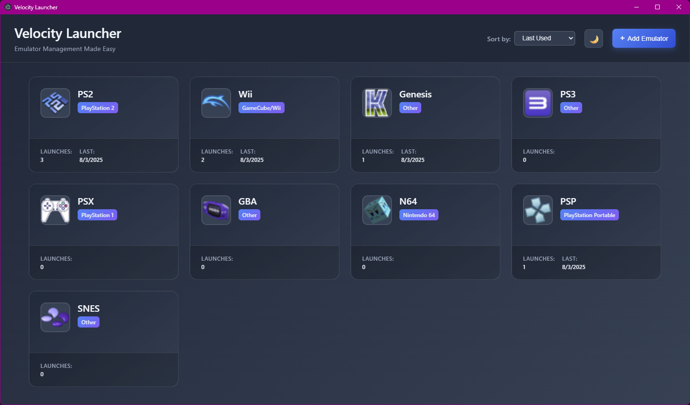
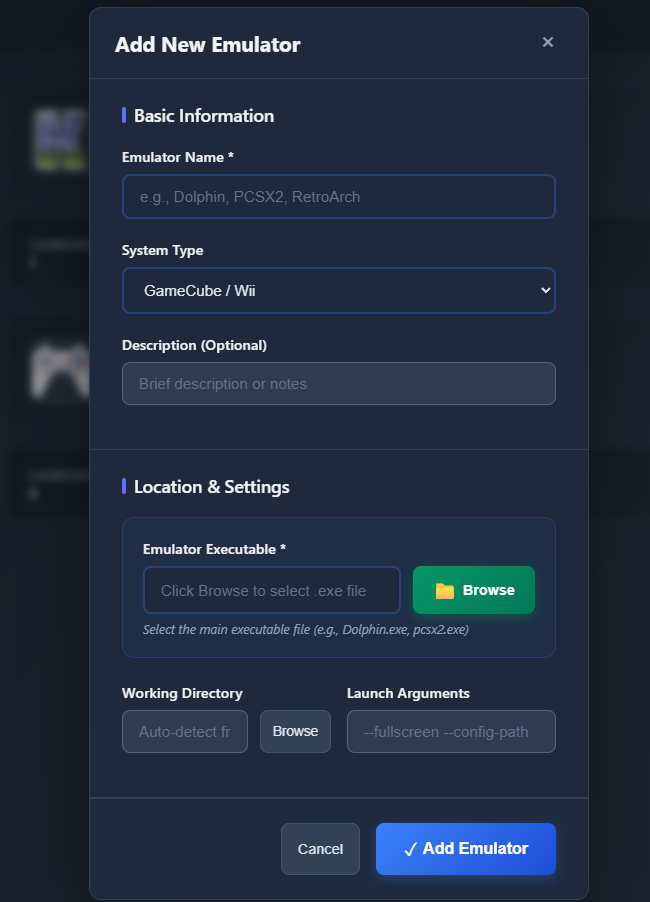
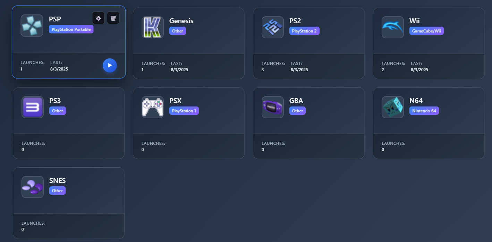

# Velocity Launcher

A modern, secure emulator launcher for Windows that makes organizing and launching your favorite retro games simple and beautiful.


_Velocity Launcher's clean, dark-themed interface_

## ✨ Features

- **🎮 Universal Emulator Support** - Launch any emulator with custom arguments and working directories
- **🖼️ Automatic Icon Extraction** - Beautiful icons extracted directly from your emulator executables
- **🔒 Security First** - Built with comprehensive security protections against malicious input
- **🎨 Beautiful Interface** - Modern dark theme with responsive grid layout
- **📊 Usage Tracking** - Keep track of launch counts and last played dates
- **🔧 Easy Configuration** - Simple forms for adding and editing emulators
- **🌙 Theme Support** - Auto, light, and dark themes that follow your system preferences
- **📂 Smart Organization** - Sort by name, date added, last launched, launch count, or emulator type

## 🚀 Quick Start

### Prerequisites

- Windows 10 or later
- Your favorite emulators already installed

### Installation

1. **Download the latest release** from the [Releases page](https://github.com/Patonero/velocity/releases)
2. **Extract the zip file** to your desired location (e.g., `C:\Program Files\Velocity Launcher\`)
3. **Run `Velocity Launcher.exe`** to start the application

> 💡 **First Launch**: The app will create its configuration folder at `%APPDATA%\velocity\` automatically

## 📋 Setup Guide

### Adding Your First Emulator

1. **Click "Add Emulator"** on the main screen
2. **Fill in the details**:
   - **Name**: Display name for your emulator (e.g., "PlayStation 2")
   - **Type**: Select from popular emulator types or choose "Other"
   - **Description**: Optional description for your setup
   - **Executable Path**: Browse to your emulator's .exe file
   - **Arguments**: Optional command-line arguments for the emulator
   - **Working Directory**: Optional working directory (usually the emulator's folder)


_Easy emulator configuration_

3. **Click "Add Emulator"** to save

## 🎮 Using Velocity Launcher

### Launching Games

- **Click any emulator card** to launch the emulator instantly
- **Use the play button** (▶) for explicit launching
- **View launch statistics** including launch count and last played date

### Managing Emulators

- **Edit**: Click the ⚙️ button to modify emulator settings
- **Delete**: Click the 🗑️ button to remove an emulator
- **Sort**: Use the dropdown to organize by name, date, usage, or type


_Your emulator collection at a glance_

### Customization

- **Theme Toggle**: Click the theme button to cycle between Auto/Light/Dark modes
- **Grid Layout**: Responsive cards that adapt to your window size
- **Sorting Options**: Keep your collection organized how you prefer

## ⚙️ Configuration

### File Locations

- **Configuration**: `%APPDATA%\velocity\velocity-launcher-config.json`
- **Icons Cache**: `%APPDATA%\velocity\icons\`
- **Logs**: Check the application folder for any error logs

### Manual Configuration

Advanced users can edit the configuration file directly:

```json
{
  "emulators": [
    {
      "id": "unique-identifier",
      "name": "PlayStation 2",
      "executablePath": "C:\\Emulators\\PCSX2\\pcsx2-qt.exe",
      "workingDirectory": "C:\\Emulators\\PCSX2\\",
      "platform": "Windows",
      "emulatorType": "PlayStation 2",
      "arguments": "--fullscreen",
      "dateAdded": "2024-01-01T00:00:00.000Z",
      "launchCount": 5,
      "lastLaunched": "2024-01-15T12:30:00.000Z",
      "iconPath": "C:\\Users\\You\\AppData\\Roaming\\velocity\\icons\\unique-identifier.png"
    }
  ],
  "theme": "dark",
  "sortBy": "name"
}
```

## 🔐 Security Features

Velocity Launcher is built with security as a top priority:

- **Input Validation**: All user input is sanitized to prevent injection attacks
- **Path Validation**: File paths are validated to prevent directory traversal
- **Process Security**: Emulator launches use secure process spawning
- **Content Security**: Built-in XSS protection and Content Security Policy
- **Secure Icon Extraction**: Safe PowerShell execution for extracting emulator icons

## 🛠️ Development

### Building from Source

1. **Clone the repository**:

   ```bash
   git clone https://github.com/Patonero/velocity.git
   cd velocity-launcher
   ```

2. **Install dependencies**:

   ```bash
   npm install
   ```

3. **Build the application**:

   ```bash
   npm run build
   ```

4. **Run in development mode**:
   ```bash
   npm run electron
   ```

### Running Tests

```bash
npm test                # Run all tests
npm run test:watch      # Run tests in watch mode
```

## 🤝 Contributing

We welcome contributions! Please see our [Contributing Guide](CONTRIBUTING.md) for details.

### Areas for Contribution

- 🌍 **Localization**: Help translate Velocity Launcher
- 🎨 **Themes**: Create new visual themes
- 📱 **Platform Support**: Extend to macOS and Linux
- 🔧 **Features**: Add new functionality
- 🐛 **Bug Reports**: Help us improve reliability

## 🗺️ Roadmap

Here's what we're planning for future releases:

### 🎨 Theme Editor (v2.0)

- **Custom CSS Upload**: Import your own CSS themes for complete visual customization
- **In-App Theme Editor**: Visual theme creator with color pickers and live preview
- **Theme Sharing**: Export and share custom themes with the community
- **Theme Gallery**: Browse and download community-created themes

Want to suggest a feature? [Open a feature request](https://github.com/Patonero/velocity/issues/new?template=feature_request.md)!

## 📝 Changelog

See [CHANGELOG.md](CHANGELOG.md) for a detailed history of changes.

## 🆘 Support

### Common Issues

**Q: Icons aren't showing for my emulators**
A: Make sure the executable path is correct and Velocity Launcher has permission to access the file.

**Q: My emulator won't launch**
A: Check that the executable path is valid and try launching the emulator manually first to ensure it works.

**Q: Can I add portable emulators?**
A: Yes! Just point to the portable executable file. You may want to set a working directory.

**Q: How do I backup my configuration?**
A: Copy the `%APPDATA%\velocity\` folder to back up all settings and cached icons.

### Getting Help

- 🐛 **Bug Reports**: [Create an issue](https://github.com/Patonero/velocity/issues/new?template=bug_report.md)
- 💡 **Feature Requests**: [Request a feature](https://github.com/Patonero/velocity/issues/new?template=feature_request.md)
- 💬 **Discussions**: [Join the conversation](https://github.com/Patonero/velocity/discussions)

## 📄 License

This project is licensed under the MIT License - see the [LICENSE](LICENSE) file for details.

## 🙏 Acknowledgments

- Built with [Electron](https://www.electronjs.org/) for cross-platform desktop development
- UI icons from the system emoji set
- Inspired by modern launcher applications and the retro gaming community

---

<div align="center">

**Enjoy your retro gaming! 🎮**

[⭐ Star this repository](https://github.com/Patonero/velocity) if you find it useful!

</div>
